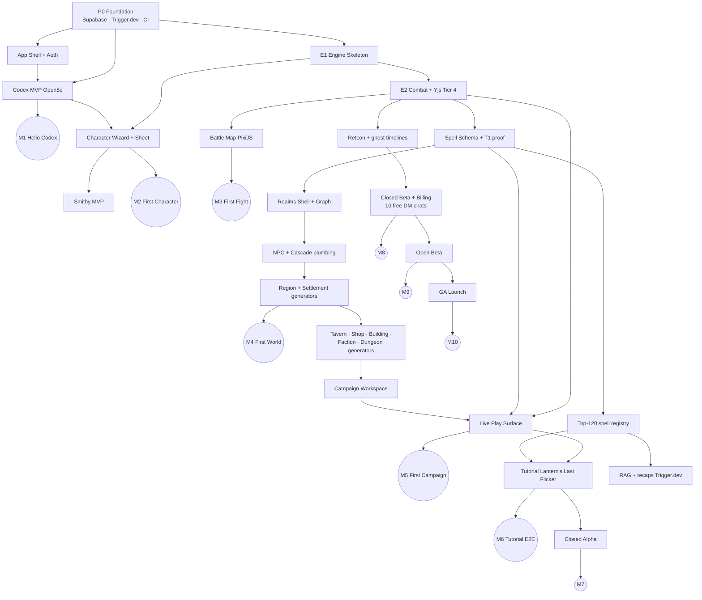

# Loreforge v1 — Implementation Roadmap

*Phased delivery plan for solo-engineer v1. Calendar anchor: **M0 = May 2026**. Canonical product decisions: `docs/product-spec.md` §5. Engine-only phasing: `docs/engine/architecture.md` §16.*

---

## 1. Executive Summary

Loreforge ships as a **solo-engineer** effort over **~28–34 months to GA** (target **Q1–Q3 2029**), with **closed alpha ~Q2–Q3 2028**. The plan interleaves one **engine track** and one **product track** on the same person — not parallel teams.

**v1.0 scope locks:**
- Deterministic 5E engine + Tier 4 multiplayer (Yjs from day one)
- **Top-120** SRD spells in v1.0; remaining ~240 in v1.x (same schema)
- **All seven** worldbuilding generators
- Six-item nav surfaces through Live Play + Campaign workspace
- Tutorial *Lantern's Last Flicker* as **open beta / GA gate** (relaxed for closed alpha)
- **Commercial from closed beta:** 10 free **DM chats** per account, then paid

**Critical path:** Foundation → engine skeleton → combat + sync → spell foundation + top-120 → all generators + Live Play → tutorial → closed alpha → billing beta → GA.

---

## 2. Locked Decisions

| # | Area | Decision |
|---|---|---|
| 1 | Team | Solo engineer |
| 2 | Spell coverage (v1.0) | Top-120 most-played; full ~360 in v1.x |
| 3 | Generators | All 7 in v1 (no deferral) |
| 4 | M0 | May 2026 (engineering start) |
| 5 | Auth | Supabase Auth |
| 6 | Jobs | Trigger.dev (cloud; was Inngest, swapped Jun 2026 — see `01-tech-stack.md` §9) |
| 7 | Engine doc | Adopt `architecture.md` with deltas: top-120 registry, solo calendar, v1.0 test gate = top-120 golden + fixture campaign |
| 8 | Multiplayer | Tier 4 only from day one |
| 9 | Tutorial gate | Strict open beta + GA; closed alpha without polished tutorial OK |
| 10 | Beta | Three-stage: closed alpha → closed beta → open beta → GA |
| 11 | Commercial | Paid from closed beta; **10 free DM chats** (see `product-spec.md` §5.1) |
| 12 | SRD ingest | Open5e / 5e-bits first; custom SRD 5.2 migrate post-GA |

**Still open before closed beta:** price points (flat vs usage vs hybrid) and paid-plan DM allowance after the 10 free chats.

---

## 3. Phase Overview

Phases are **theme windows** (overlap is intentional). Month numbers are from M0.

| Phase | Name | Months (approx.) | Calendar (approx.) | Primary goal |
|---|---|---|---|---|
| **P0** | Foundation | M0–M1 | May–Jun 2026 | Repo, infra, provider lock, CI |
| **P1** | Skeleton + Shell | M1–M3 | Jun–Aug 2026 | Event store, Command API, auth, Codex MVP |
| **P2** | Combat + Characters | M4–M9 | Sep 2026–Feb 2027 | Tier 4 sync, combat core, char wizard, Smithy MVP |
| **P3** | Spells + Realms | M7–M13 | Dec 2026–Jun 2027 | Spell schema, Realms shell, NPC + cascade, Region/Settlement |
| **P4** | Generators + Play | M10–M22 | Jun 2027–Mar 2028 | Remaining generators, Campaign, Live Play, top-120 push |
| **P5** | Tutorial + Memory | M20–M26 | Dec 2027–Jul 2028 | Tutorial, RAG/recaps, tooltips, top-120 completion |
| **P6** | Polish + Alpha | M22–M28 | Mar–Sep 2028 | Retcon UI, sandbox, closed alpha |
| **P7** | Beta → GA | M28–M34 | Sep 2028–Mar 2029 | Closed beta, open beta, GA |

---

## 4. Milestones

Demo-able deliverables with calendar targets (solo).

| ID | Milestone | Target | Definition of done |
|---|---|---|---|
| **M1** | Hello, Codex | Aug 2026 (M3) | Supabase Auth; six-item nav; Codex browsable via Open5e ingest |
| **M2** | First character | Nov 2026 (M6) | Character Creation Wizard + read/edit sheet; Smithy MVP (item + declarative spell) |
| **M3** | First fight | Feb 2027 (M9) | 2-client Tier 4 combat: attack, conditions, OA; battle map; ~30 T1 spells |
| **M4** | First world | Jun 2027 (M13) | Realms shell (Grid/List/Graph); NPC + Region + Settlement generators; cascading stubs |
| **M5** | First campaign | Mar 2028 (M22) | All 7 generators; Campaign workspace (9 tabs); Live Play + always-on map; hook lifecycle |
| **M6** | Tutorial E2E | Jul 2028 (M26) | *Lantern's Last Flicker* internal green path; top-120 covers tutorial spells |
| **M7** | Closed alpha | Sep 2028 (M28) | 10–50 invites; unpaid; engine + play stable; tutorial WIP OK |
| **M8** | Closed beta | Dec 2028 (M31) | 100–300 waitlist; Stripe + 10-chat metering; tutorial ≥40% completion in cohort |
| **M9** | Open beta | Mar 2029 (M34) | Public signup; tutorial mandatory first-run (skip allowed) |
| **M10** | GA | Mar 2029+ (M34+) | Product metrics on track; LLM cost/session in band; pricing live |

---

## 5. Dependency Graph

**Critical path (longest chain):**  
`P0 → E1 → E2 → Spell schema → Top-120 → Live Play + generators → Tutorial → Closed alpha → Closed beta (billing) → GA`

Slippage in **top-120 authoring** or **Dungeon generator** (rooms-as-entities + Dyson map) is the highest schedule risk after sync.

---

## 6. Phase Detail

### P0 — Foundation (M0–M1) — ✅ COMPLETE (Jun 2026)

> **P0 status (Jun 2026):** Done. npm-workspaces monorepo (`apps/web`, `packages/{db,engine,config}`, `services/ws-server` skeleton); Next.js 15 App Router + tRPC + Supabase Auth; Drizzle migration `0000_p0_foundation` applied (engine tables + `codex_spells`); Supabase Auth gating verified end-to-end (sign-up → email confirm → Home shell); Open5e ingest spike validated (25 spells). On GitHub `main` with green CI (typecheck/lint/build). Local env: single root `.env.local` loaded into CLIs + Next dev via `dotenv-cli`; `DATABASE_URL` (6543 pooler) vs `DIRECT_URL` (5432, migrations). Setup steps in `docs/setup/p0-supabase-trigger.md`.
>
> **Deferred from P0 into P1-as-needed (not blockers):** Trigger.dev project/keys (no real jobs until P1 nightly ingest); Vercel deploy (repo pushed, unblocked); Sentry/PostHog account provisioning (env-gated stubs in code). Note: package manager is **npm**, not pnpm (corepack EPERM on the dev machine).

**Product**
- Monorepo: Next.js App Router, tRPC, Drizzle, `@app/engine` package stub
- Supabase project: Postgres, Auth, Storage
- Trigger.dev project (dev + prod environments; tasks run on Trigger.dev infra)
- Vercel + Railway/Fly skeleton; Sentry + PostHog
- Open5e ingest spike → internal Codex schema

**Engine**
- Drizzle tables: `engine_events`, `engine_command_log`, `engine_snapshots` (empty handlers OK)

**Exit:** authenticated user lands on empty Home.

---

### P1 — Engine Skeleton + App Shell (M1–M3) — ✅ COMPLETE (Jun 2026)

> **P1 status (Jun 2026):** Done — **M1 "Hello, Codex" reached.** Engine **E1 skeleton** and the **M1 product surfaces** are implemented and green (typecheck/lint/build + 67 engine tests; CI green on `main`). The **full Open5e SRD spell ingest** now runs as a **scheduled nightly Trigger.dev job** (cron `0 8 * * *`, deployed to prod as version `20260619.1`, project `proj_pywyqcovveavdmoqpzsg`) — the first real background job — pulling the full SRD 5.1 document (`srd-2014`, ~319 spells) into `codex_spells` via a shared `ingestOpen5eSpells()` lib reused by the manual CLI. A prod run is verified green (319 upserted). Deferred to P2: Postgres-backed per-campaign event persistence behind the engine tRPC router (lands with campaigns/combat — issue #2). Remaining P1+P2 work is filed as GitHub issues #2–#16.
>
> **Trigger.dev wiring notes (Jun 2026):** the v4 CLI bin is `trigger` (not `trigger.dev`); all `@trigger.dev/*` packages must be pinned to the exact CLI version; OpenTelemetry needs `import-in-the-middle`/`require-in-the-middle` with an npm override pinning `import-in-the-middle` to v3; `trigger.config.ts` hardcodes the (non-secret) project ref so `trigger deploy` works without env loading. The CLI is logged in (PAT stored); only the `tr_dev_` runtime secret key is on hand — the `tr_prod_` key is needed only once the app triggers tasks at runtime.
>
> **Engine (`packages/engine`, E1 skeleton):**
> - Seeded deterministic RNG (`xmur3`→`mulberry32`) + dice service (notation parsing, keep-highest/lowest, advantage/disadvantage).
> - Append-only event model + `EventStore` contract with an in-memory implementation; per-campaign sequencing, `readAfter`/`truncate` (retcon-ready).
> - `WorldState` projection: pure reducer (`applyEvent`) + full `rebuild` from genesis; immutable updates; HP/temp-HP/clamp/alive, scenes, positions.
> - Base entity model (Character/NPC/Monster + Scene) + ability helpers (modifier, proficiency bonus, multiclass total level).
> - Command API: typed `Command` union, structured `ValidationFailure`/`CommandResult`, per-command handlers (create scene/entity, change scene, roll dice, apply damage/healing, move), `CampaignCommandQueue` (serialized per-campaign execution, §10.2).
> - `Engine` wires store + RNG (streams keyed `${seed}:${scope}:${drawIndex}`, draw counters restored from the log on hydrate) + incremental projection. Randomness resolved at command time and recorded in `DiceRolled` events → replay is deterministic.
> - Vitest harness wired (`npm run test`); 67 tests incl. determinism + golden replay (rebuild == live).
>
> **tRPC bindings:** `engine` router — `fixtureState` (read model) + `simulate` (zod-validated command batch run deterministically through the engine, returns results + final state; same Command surface the AI Orchestrator will use). `codex` router — `listSpells` (search/level/school + pagination), `spellFacets`, `getSpell`, `spellCount`.
>
> **Product:**
> - Six-item nav (P0) + fleshed-out **Home** (surface entry-point cards + system status: engine version, ingested spell count).
> - **Codex MVP** — `/codex` read-only SRD **spells** browser over the Open5e ingest: hero + category pills, search, level/school filter chips, paginated card grid, slide-over detail panel (defensive render of the raw SRD record). Other categories stubbed "soon".
> - **Read-only character sheet** — `/characters` list + `/characters/[id]` sheet (ability scores/modifiers, AC/HP/speed/init/prof, saving throws w/ proficiency, skills) derived via `@app/engine`; SSG from `FIXTURE_CHARACTERS`.

**Engine (E1)** — see `architecture.md` §16 E1  
Event store, projections, dice, Command API + tRPC, base entities, ~50 tests.

**Product**
- Six-item top nav + Home shell
- **Codex MVP** (read-only SRD reference) — first library surface; validates IA for Smithy/Realms
- Character sheet **read-only** (fixture data)

**Milestone:** M1.

---

### P2 — Combat Core + Characters + Smithy (M4–M9)

**Engine (E2)** — see `architecture.md` §16 E2  
Combat pipeline, all conditions, action economy, initiative, movement/LOS, rests, concentration, OA reactions, **Yjs sync**, per-campaign command queue.

**Product**
- Character Creation Wizard + inline edit + level-up scaffolding
- **Smithy MVP** — custom items, declarative custom spells (sandbox deferred)
- PixiJS battle map + token drag
- UI order: Characters dashboard before deepening Codex

**Milestones:** M2 (mid), M3 (end).

---

### P3 — Spell Foundation + Realms Shell (M7–M13) — ✅ COMPLETE at tracer depth (Jun 2026)

> **P3 status (Jun 2026):** Done — **M4 "First World" reached.** Engine E3 spell-cast pipeline + caster scaffolding shipped, plus spell families: AoE with save-for-half + upcast, healing, bonus-action, cantrip scaling (#40–#43). **Realms shell** is live: flat-by-type sidebar, Grid/List/**Graph** views, relationship panels, all entity types, NPC end-to-end with manual create + cascading-stub + "Expand with Generator" (#41, #44, #50). The **Realms AI generator pipeline** also landed here (see plan `realms_generator_pipeline_50e6bfcd`, D1–D11): `@app/llm` package, `generation_events` audit table (migration `0007`), `realms.generate`/`expandStub`/`regenerate` (field-subset) + synchronous tRPC cascade + durable Trigger.dev cascade. Discovery state stubbed (lands with Campaign — see `docs/deferrals.md` CAMP-4). Per-surface depth and remaining gaps tracked in `docs/deferrals.md` §3.5 (Realms) and §1 (generator pipeline). Top-120 spell curation continues into P5 (ENG-2).

**Engine (E3)** — see `architecture.md` §16 E3–E4 start  
`SpellDefinition`, effects, stacking, AoE on map; begin top-120 list curation.

**Product**
- **Realms** — flat-by-type sidebar, Grid/List/**Graph**, relationship panels
- **NPC** entity + manual create; **cascading stub** + "Expand with Generator"
- **Generators:** Region, Settlement (largest cascade patterns)
- Discovery state (per-campaign) wired when Campaign exists; stub in Realms-only mode OK

**Milestone:** M4.

---

### P4 — Generators + Campaign + Live Play (M10–M22) — 🚧 STARTED (M5 ~30%, Jun 2026)

> **P4 status (Jun 2026):** Started toward **M5 "First Campaign."** Built so far: the shared generator pipeline + tracer-depth NPC/Region/Settlement (in P3 above) and a generic **Advanced Form** that can emit any type onto thin schemas.
>
> **Intentional deviation from the prescribed generator order/depth (record, not drift):** the plan below sequences 7 **rich per-type** generators (Tavern→Shop→Building→Faction→Settlement→Region→Dungeon) on rich tabbed schemas. We instead shipped a **generic thin-schema pipeline for all types** + tracer-depth NPC/Region/Settlement + an Advanced Form over the thin `REALM_FIELDS` schemas. This satisfies M4's NPC+Region+Settlement at tracer depth but **not** the rich P4/M5 generators. The "ship-fast over current schemas" choice is deliberate; the rich per-type schema expansion (`docs/deferrals.md` GEN-1) gates the 5 unbuilt rich generators (GENR-1–5) and rich Realms detail tabs (REALM-1).
>
> **Remaining for M5** (all in `docs/deferrals.md`): rich per-type schemas + tabbed detail (GEN-1, REALM-1, REALM-4); 5 rich generators (GENR-1–5); **Campaign workspace** — 9 tabs, currently 0/9 (CAMP-1–15), incl. Plot Hook Kanban (CAMP-5) and per-campaign discovery state (CAMP-4); full **Live Play** surface — chat/HUD/combat overlay (PLAY-1–14); name-match dedup + auto-link/conflict (GEN-2, GEN-5). Requires the Trigger.dev `tr_prod_` runtime key for runtime cascades (INFRA-1).

**Generator order** (after Region/Settlement; see `generators/forms-and-pages.md`):

| Order | Generator | Est. weeks | Notes |
|---|---|---|---|
| 1 | NPC | (P3) | Prerequisite for all cascades |
| 2 | Tavern | 4–5 | Menu + floor plan patterns |
| 3 | Shop | 5–6 | Inventory ↔ engine transactions |
| 4 | Building | 4–5 | Floor plans, custom sections |
| 5 | Faction | 6–8 | Crest, relational graph |
| 6 | Settlement | 8–10 | Richest tab set; reuse tavern/shop/building |
| 7 | Region | 8–10 | Deepest cascade |
| 8 | Dungeon | 8–10 | Rooms as entities; Dyson map; encounter promotion |

Settlement/Region are sequenced **after** Tavern/Shop/Building so child patterns exist.

**Product**
- **Campaign workspace** — 9 tabs, Plot Hook Kanban (Suggested → Active → Resolved)
- **Live Play** — map above chat, character HUD, memory panel, optional TTS (cached via Trigger.dev)
- Campaign creation: Quick Forge / Guided / Empty World
- Hybrid tempo: async default; combat → Live Session Mode

**Engine**
- Top-120 authoring in parallel (tutorial spells prioritized)

**Milestone:** M5.

---

### P5 — Tutorial + Memory Tier (M20–M26)

**Product**
- **Lantern's Last Flicker** — scripted state machine, pre-canned narration backbone, tooltips, hints, graduation modal, replay-from-start
- RAG: pgvector embeddings, rolling summary, auto-recap jobs (Trigger.dev)
- Global + tutorial tooltip system

**Engine**
- Complete top-120 golden tests + fixture campaign regression
- Tutorial combat spells verified: *Hunter's Mark*, *Cure Wounds*, *Sacred Flame*, etc.

**Milestone:** M6.

---

### P6 — Polish + Closed Alpha (M22–M28)

**Engine (E5)** — retcon UI, QuickJS Smithy sandbox, perf/sync stress, LLM tool-adherence harness.

**Product**
- Closed **alpha**: invite codes, PostHog funnels, unlimited chats (no billing)
- Mobile degraded layout pass; keyboard/a11y best-effort

**Alpha gate (see §7):** tutorial optional; combat + Live Play + ≥3 generators stable.

**Milestone:** M7.

---

### P7 — Beta → GA (M28–M34+)

**Closed beta**
- Stripe (or Supabase billing) live
- **10 free DM chats** enforced (`product-spec.md` §5.1)
- Price model locked (usage / flat / hybrid)

**Open beta**
- Public signup; tutorial mandatory first-run
- Monitor: tutorial completion, LLM $/session, rejection rate <2%

**GA**
- Marketing site; referral/recap share loop
- Begin custom SRD 5.2 ingest migration

**Milestones:** M8, M9, M10.

---

## 7. Beta & Launch Gates

### Closed alpha (M7)

| Criterion | Required |
|---|---|
| Tutorial E2E | No (WIP OK) |
| Tier 4 sync | 6-client stress; P95 broadcast <500ms |
| Top-120 spells | 100% golden pass on shipped set |
| Spell set includes tutorial needs | Yes |
| Generators | ≥ Region, Settlement, Tavern + Live Play |
| Billing | Off |
| LLM tool-adherence harness | >98% on fixture scenarios |

### Closed beta (M8)

| Criterion | Required |
|---|---|
| Tutorial E2E internal | 10 consecutive green runs |
| Tutorial completion (cohort) | ≥40% |
| All 7 generators | Shipped |
| Billing + 10 DM chats | Live |
| Player-reported AI mistakes | ≤2/session avg |
| Retcon UI | Shipped |

### Open beta / GA (M9–M10)

| Criterion | Required |
|---|---|
| Tutorial first-run | Mandatory (skip allowed) |
| Tutorial completion target | ≥60% (GA marketing) |
| LLM cost/session | $0.50–$3 on real traffic |
| Crash-free sessions (30d) | >99% |
| Pricing | Live |

---

## 8. UI Surface Build Order

Locked sequence (from design + AGENTS handoff), aligned to phases:

1. **Home** (P1)
2. **Characters** — dashboard → wizard → sheet → level-up (P2)
3. **Codex** (P1 MVP, enrich ongoing)
4. **Smithy** (P2)
5. **Realms** (P3–P4)
6. **Campaigns** workspace (P4)
7. **Live Play** (P4)
8. **Tutorial** route (P5)

Maps are **not** top-level nav — always-on in Live Play; editors live on entity detail pages.

---

## 9. Multiplayer Infra

**No Tier 1 → Tier 4 cutover.** Yjs over WebSocket ships with combat (P2). Server-authoritative engine; Yjs carries projection diffs only (`architecture.md` §10).

---

## 10. Risks & Mitigations (Schedule)

| Risk | Impact | Mitigation |
|---|---|---|
| Solo serializes engine + product | +6–10 mo vs 2–3 engineer plan | Top-120; strict phase focus; no scope creep |
| Top-120 list wrong | Gameplay gaps in beta | Curate from play-frequency data + tutorial requirements early |
| All 7 generators | ~10–13 engineer-months | Reuse detail-page shell; generator order minimizes rework |
| LLM cost at open beta | Margin | Meter DM chats; closed beta measures $/session |
| Tutorial as GA gate | Delays marketing | Alpha without tutorial; only open beta strict |
| Support load solo | Burnout | Closed alpha 10–50; cap closed beta waitlist |

---

## 11. Post-GA (v1.x)

- Remaining ~240 SRD spells (registry expansion, no schema break)
- Custom SRD 5.2 ingest replaces Open5e as canonical
- STT, AI image gen, painterly map overlay (v1.5 per consolidated plan)
- Deep-dive tutorials (Smithy, Realms, multiplayer hosting)

---

## 12. Document Map

| Doc | Role |
|---|---|
| `00-consolidated-plan.md` | 19 architectural decisions |
| `01-tech-stack.md` | Stack rationale |
| `02-implementation-roadmap.md` | **This file** — sequencing & gates |
| `product-spec.md` §5 | Locked product/commercial decisions |
| `engine/architecture.md` §16 | Engine-only phases |
| `generators/forms-and-pages.md` | Per-generator effort & UX |
| `onboarding/tutorial-adventure.md` | Tutorial spec + dependencies |

---

*Last updated: May 2026 — reflects grill-me session locks.*
