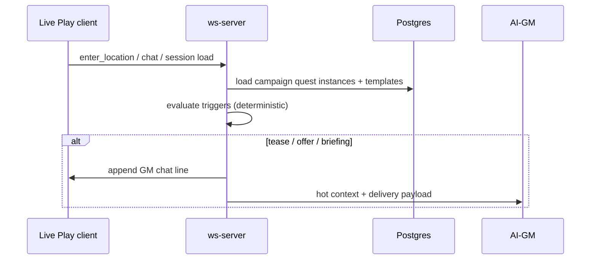

# Quests — Design Spec (Locked Jun 2026)

Authoritative spec for Loreforge’s **unified Quest system**: structured storylines with triggers, GM instructions, linear steps (v1), and campaign-scoped lifecycle. Replaces the tracer **Plot Hook** model (`title` + `summary` strings, `data.hooks` string arrays) while preserving Q7 embed-until-accept semantics.

**Provenance:** Jordan’s Friends-and-Fables-scale requirements (Jun 2026) + grill-me session (13 decisions, all locked below).

**Related docs:** `docs/00-consolidated-plan.md` (Q7), `docs/ui-flows/campaigns-workspace.md` (Tab 4 — update label to Quests), `docs/generators/forms-and-pages.md` (Plot Hooks sections → Quest templates), `docs/deferrals.md` (CAMP-5, RUNG-4 Slice 3 tease).

---

## 1. Product intent

Quests are **editable, trigger-driven storylines** the AI-GM can tease, offer, and run with mechanical fidelity:

- **Realms** stores reusable **quest templates** embedded on world entities (region, settlement, tavern, dungeon, NPC, etc.).
- **Campaign** stores **quest instances** after accept — Kanban lifecycle, progress through steps, session linkage.
- **Live Play** evaluates **triggers** (enter location, talk to NPC, session start, accept) and injects the right **delivery mode** (tease / offer / briefing) into chat + AI hot context.

Competitive bar: depth comparable to **Friends & Fables** quest authoring (title, description, tags, prerequisites, GM instructions, steps, rewards, linked entities/locations/encounters). v1 ships a **tracer subset** from generators; authors expand in editors.

---

## 2. Locked decisions (grill-me, Jun 2026)

| # | Decision | Choice |
|---|----------|--------|
| 1 | Model | **Unified Quest** — no parallel “simple hooks” tier; expand/rename Plot Hooks into Quests |
| 2 | Campaign tab UI | Rename tab **Hooks → Quests** (six top-level nav items unchanged) |
| 3 | v1 runtime triggers | **Core four:** `on_session_start`, `on_enter_location`, `on_talk_to_npc`, `on_quest_accept` |
| 4 | v1 structure | **Linear steps only**; branching graph → Phase D |
| 5 | AI bounds | **GM instructions are canon**; AI improvises color/dialogue only — no skipping steps, changing rewards, or resolving branches without player/engine events |
| 6 | Templates per entity | **Many** quest templates per Realms entity |
| 7 | Delivery modes | **Tease** (one-line), **Offer** (giver pitch), **Briefing** (full GM pack + active step in hot context) |
| 8 | Lifecycle | Keep Kanban: **Suggested → Open → Active → Resolved → Abandoned** |
| 9 | Rewards | Schema stores XP/loot/reputation; **engine grants on Resolve in Phase D** (v1: stored + narrated) |
| 10 | Prerequisites | **Hard** gates (level, prerequisite quest Resolved) block Accept/Active; **soft** tags (mystery/social/…) are filters only |
| 11 | Migration | **Auto-migrate** existing `plot_hooks` rows + string `data.hooks` → minimal quest templates |
| 12 | Generator output | **Tracer quest:** title, tags, tease, location/giver refs, 1–3 linear steps, GM instructions stub |
| 13 | Editors | **Realms** entity detail (template CRUD) + **Campaign Quests** tab (instance lifecycle + progress) |

---

## 3. Concepts

### 3.1 Template vs instance

| | Quest template | Quest instance |
|---|----------------|----------------|
| **Lives in** | Realms entity `data.quests[]` (new) | Campaign DB (`plot_hooks` → `quests` table evolution) |
| **Scope** | Reusable across campaigns | One campaign |
| **Edited when** | Worldbuilding / prep | During play (status, current step, outcome) |
| **Created by** | Generators, Realms UI, accept-bridge | **Accept** from Suggested (Q7) |

Accepting a template copies (or references) into a campaign instance. Template edits do not retroactively change accepted instances (instances snapshot template version at accept — see §6.3).

### 3.2 Delivery modes

| Mode | Player sees | AI-GM gets |
|------|-------------|------------|
| **Tease** | Short in-fiction hook (e.g. “Word reaches you: …”) | Optional one-line + quest id for RAG; no full instructions |
| **Offer** | NPC/ scene pitch — accept/decline implied | Offer text + quest summary + giver/location refs |
| **Briefing** | Transition into active quest (may be minimal if AI narrates) | Full **GM instructions**, active **step** text, linked entities, constraints from §2.5 |

Mapping to triggers (default; author can override per quest):

| Trigger | Default delivery |
|---------|------------------|
| `on_session_start` | Tease (if quest Open and tease not yet shown) |
| `on_enter_location` | Tease (starting location or linked location) |
| `on_talk_to_npc` | Offer (quest giver NPC) |
| `on_quest_accept` | Briefing (status → Active) |

### 3.3 Triggers (v1)

```typescript
type QuestTriggerType =
  | "on_session_start"
  | "on_enter_location"
  | "on_talk_to_npc"
  | "on_quest_accept";

type QuestTrigger = {
  type: QuestTriggerType;
  /** Which delivery mode to use when this trigger fires. */
  delivery: "tease" | "offer" | "briefing";
  /** Optional: only fire when instance status matches (e.g. open, active). */
  whenStatus?: QuestStatus[];
  /** Type-specific config — see below. */
  config?: {
    locationEntityId?: string;   // on_enter_location
    npcEntityId?: string;        // on_talk_to_npc
  };
};
```

**Deferred triggers (Phase C+):** `on_discovery`, `on_step_complete`, `on_combat_end`, `on_item_found`, `manual_gm`.

**Evaluation rules:**

- Triggers are evaluated **deterministically** in ws-server / Live Play orchestrator (not LLM).
- Hard prerequisites checked before Accept / before Offer is shown.
- Tease dedupe: at most one tease per quest instance per session (or until status changes) — store `lastTeasedAt` / flags on instance.
- `on_talk_to_npc`: fire when player message mode is Speak/Action and text references giver NPC **or** player clicks NPC token / `@NPC` chip (implementation detail in Phase C).

---

## 4. Quest template schema (Realms embed)

Replace `data.hooks: string[]` with `data.quests: QuestTemplate[]`. Strings migrate to minimal templates (§9).

```typescript
type QuestTag =
  | "mystery"
  | "puzzle"
  | "social"
  | "investigation"
  | "combat"
  | "exploration"
  | "horror"
  | "political"
  | "dungeon"
  | "rescue"
  | "heist";

type QuestScale = "personal" | "local" | "regional" | "campaign";

type QuestTemplate = {
  /** Stable id within entity data (uuid). */
  id: string;
  title: string;
  /** Player-facing summary / back-cover blurb. */
  description: string;
  tags: QuestTag[];
  scale?: QuestScale;

  /** Soft filters — never block accept. */
  /** Hard — block Accept/Active if not met. */
  minLevel?: number;
  prerequisiteQuestTemplateIds?: string[]; // same entity or cross-entity refs by uuid

  /** Realms entity ids. */
  startingLocationEntityId?: string;
  questGiverNpcEntityId?: string;
  linkedEntityIds?: string[];
  linkedLocationEntityIds?: string[];
  /** Future: encounter ids from Campaign Combat tab or dungeon room refs. */
  linkedEncounterRefs?: string[];

  /** Author → AI-GM: how to present and run this quest. */
  gmInstructions: string;

  /** Player-facing lines per delivery mode (optional — AI may paraphrase). */
  teaseText?: string;
  offerText?: string;

  triggers: QuestTrigger[];

  /** v1: ordered linear steps. Phase D: graph via `nextStepId` branches. */
  steps: QuestStep[];

  /** Stored for Phase D engine resolve; narrated in v1. */
  rewards?: {
    xp?: number;
    lootNotes?: string;
    reputationNotes?: string;
  };

  /** Generator metadata. */
  source?: "generator" | "manual" | "migrated";
};

type QuestStep = {
  id: string;
  title: string;
  /** Player-facing objective (optional). */
  description?: string;
  /** GM-only: what must happen before advance. */
  gmInstructions: string;
  /** Optional entity/location refs for this step. */
  locationEntityId?: string;
  npcEntityId?: string;
  /** Phase D: encounter spawn hint. */
  encounterRef?: string;
  /** Phase D: branch targets. Omitted in v1. */
  nextStepId?: string;
  alternateNextStepIds?: string[];
};
```

**Generator tracer contract (locked):** each cascade parent emits **1–3** quest templates with: title, 1–2 tags, teaseText, startingLocationEntityId and/or questGiverNpcEntityId (when inferable), 1–3 steps (title + short gmInstructions), triggers defaulting to enter-location tease + talk-to-npc offer + on_accept briefing.

---

## 5. Quest instance schema (Campaign)

Evolve `plot_hooks` → **`quests`** (table rename or compatibility view). Minimum columns + JSON payload:

| Column | Purpose |
|--------|---------|
| `id` | uuid |
| `campaign_id`, `owner_id` | scope |
| `title`, `summary` | display (denormalized from template at accept) |
| `status` | `suggested` \| `open` \| `active` \| `resolved` \| `abandoned` |
| `source_entity_id` | Realms entity quest was accepted from |
| `source_template_id` | uuid of template within entity `data.quests` |
| `data` | jsonb: `QuestInstanceData` |

```typescript
type QuestInstanceData = {
  /** Snapshot of template fields at accept (authoritative for this run). */
  templateSnapshot: QuestTemplate;
  currentStepId?: string;
  completedStepIds: string[];
  /** Trigger dedupe / audit. */
  teasedSessionIds?: string[];
  acceptedAt?: string;
  resolvedAt?: string;
  abandonedReason?: string;
  outcomeNotes?: string;
};
```

**Suggested column:** auto-feed from Realms templates on World-tab entities not yet accepted (same as today’s pending hooks, but structured).

**Accept flow (Q7 preserved):** Suggested → Open copies template snapshot → instance row. Player or GM moves Open → Active (may fire `on_quest_accept` briefing).

---

## 6. AI-GM integration

### 6.1 Hot context injection

When a quest is **Active**, inject into AI-GM hot tier (alongside pacing, party, scene):

- Quest title, current step title + gmInstructions
- Quest-level gmInstructions (abbreviated if long)
- Linked entity names (resolved from ids)
- Constraints: “Do not grant XP or loot unless engine events say so” (until Phase D)

### 6.2 Improvisation bounds (locked)

- AI **may** paraphrase tease/offer/briefing and roleplay NPC dialogue.
- AI **must not** mark steps complete, change rewards, or skip prerequisites without a player action or engine event that the orchestrator records.
- Step advancement (Phase C+): explicit player milestone, GM “Resolve step” control, or deterministic trigger — not LLM self-report.

### 6.3 Template versioning

At accept, **snapshot** template into instance. Realms template edits do not mutate running campaigns. Optional future: “Sync from Realms” on Open instances only.

---

## 7. Authoring UX

### 7.1 Realms entity detail

New **Quests** section (per entity type that supports `data.quests`):

- List templates with title, tags, scale, giver/location chips
- Inline edit / add / delete / duplicate
- Per-section regenerate (generator) where applicable
- “Accept into campaign” only from Campaign workspace (not Realms)

### 7.2 Campaign workspace — Quests tab (renamed from Hooks)

- Five-column Kanban (unchanged semantics)
- Detail panel: full template snapshot, progress (current step), prerequisites, triggers (read-only from snapshot), linked entities, GM instructions (collapsible), rewards (read-only until Phase D grant)
- Actions: Accept, Start (→ Active), Pause, Resolve, Abandon, Edit outcome notes
- Views: Kanban (default), List, Timeline (session axis — existing tracer)

### 7.3 Filters (from wireframes)

Scale, tags, starring NPC, region/location, status — soft filters on board.

---

## 8. Live Play runtime



**Replaces RUNG-4 Slice 3** `extractOpeningHookText` string tease with trigger evaluator + `teaseText` on quest templates.

**Prerequisite checks:** before showing Offer or allowing Accept, validate `minLevel` (party max or avg level — **decision: use highest-level PC** unless playtesting says otherwise) and `prerequisiteQuestTemplateIds` (resolved instances must be `resolved` in same campaign).

---

## 9. Migration

1. **`data.hooks` strings** → `QuestTemplate` with `title = first line`, `teaseText = string`, `triggers: [{ type: on_enter_location, delivery: tease }]`, `steps: []`, `source: migrated`.
2. **`plot_hooks` rows** → quest instances with minimal `templateSnapshot` built from title/summary.
3. **Slice 3 code path** reads quests via trigger evaluator; keep fallback read of legacy strings until migration job completes.

One-time migration script + Drizzle migration for `data` jsonb column / table rename.

---

## 10. Phased delivery

| Phase | Scope | Exit criteria |
|-------|--------|---------------|
| **A — Structured template + tease runtime** | `QuestTemplate` schema; Realms `data.quests`; generator tracer output; auto-migration; triggers `on_session_start` + `on_enter_location`; tease delivery; deprecate string hooks | Fresh Quick Forge → enter tavern → tease fires from structured quest |
| **A.1 — Cascade quest inheritance** ✅ | Parent region quests propagate to location stubs on forge; ws-server read-time fallback via `located_in` parent chain; force-rebind `startingLocationEntityId` on inherit (#222, #223, #224) | Fresh Quick Forge → session start at tavern → `Word reaches you:` tease fires — **prod verified Jun 2026** |
| **B — Quest editor** ✅ | Realms Quests section CRUD; Campaign Quests tab detail + accept snapshot; Kanban rename Hooks→Quests | Author full quest in Realms; accept; see on board with template snapshot — **prod verified Jun 2026** |
| **C — Talk + accept runtime** ✅ | `on_talk_to_npc` offer + `on_quest_accept` briefing in Live Play; hot context for Active quests; step list in detail panel | Talk to giver → offer; Start → Active → briefing; AI gets GM instructions — **prod verified Jun 2026** |
| **D — Rewards + branches** ✅ | Prerequisite gates; step advance + branch UI; engine XP on Resolve; encounter refs on steps; List/filters; `quests` tRPC (+ `hooks` alias) | Resolve quest → XP to party PCs; branch choice stored; Realms editor full F&F core fields |

**Explicitly not in v1 quest scope:** per-step engine XP, `on_combat_end` triggers, full F&F parity on first generator pass, quest editor on mobile.

---

## 11. Engineering notes

- **Table naming:** Prefer rename `plot_hooks` → `quests` with migration alias period, or keep table name and rename TypeScript types only — implementer choice; UI says Quests.
- **tRPC:** evolve `hooks` router → `quests` (aliases deprecated one release).
- **RAG:** embed quest title + description + gmInstructions per template (MEM tier).
- **Tests:** trigger evaluator pure functions; prerequisite gate; migration golden cases.
- **Docs to update on Phase A ship:** `docs/deferrals.md` (CAMP-5, RUNG-4 Slice 3), `CONTEXT.md`, `docs/00-consolidated-plan.md` § IA (Hooks → Quests tab label), `AGENTS.md` if Q7 wording changes.

---

## 12. Open items (non-blocking for Phase A)

| Item | Default if unset |
|------|------------------|
| Party level for `minLevel` gate | Highest-level PC in campaign party |
| Decline / reject offer | No instance row; tease may repeat next session |
| Multiplayer: who can Accept | Any party member with campaign write access |
| Quest overlap (two Active) | Allowed; hot context includes all Active (cap 3) |

---

## 13. Acceptance criteria (Jordan sign-off)

- [x] Can embed **multiple** quests on one Realms settlement/tavern
- [x] Accept promotes to Campaign **Suggested → Open** with snapshot
- [x] Enter starting location fires **tease** without manual GM action
- [x] Talk to quest giver fires **offer** (Phase C)
- [x] Accept/start fires **briefing** and AI respects GM instructions bounds
- [x] Quest editor matches core F&F fields: title, description, tags, prerequisites, level, starting location, giver, GM instructions, steps
- [x] Legacy string hooks migrated without data loss (`normalizeEntityQuests` on read + optional `backfill:plot-hooks-quests` for instances)
